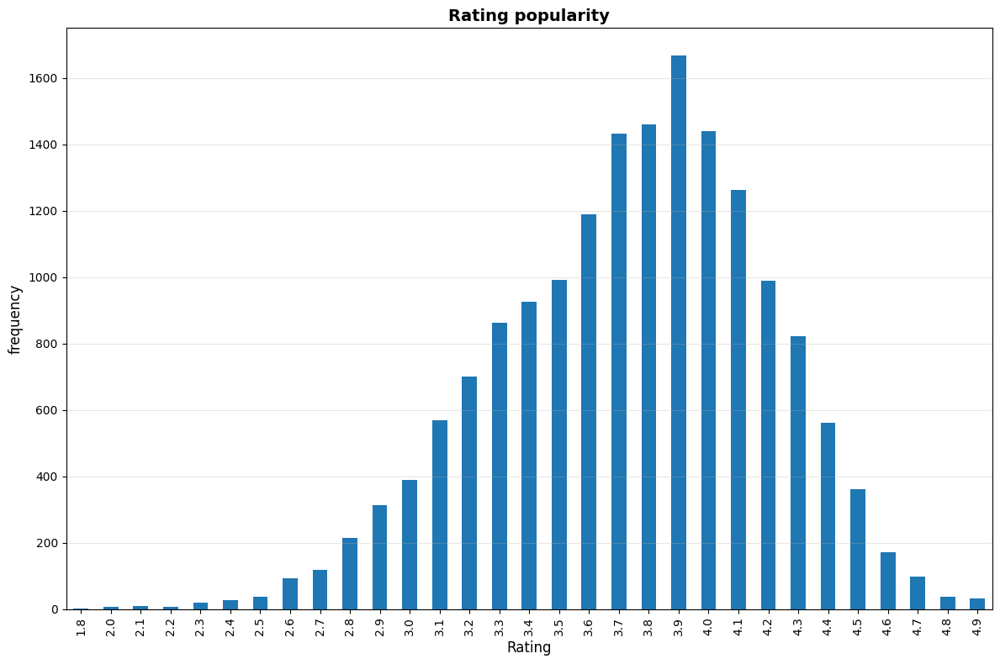
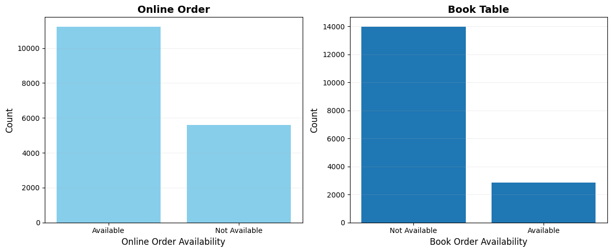
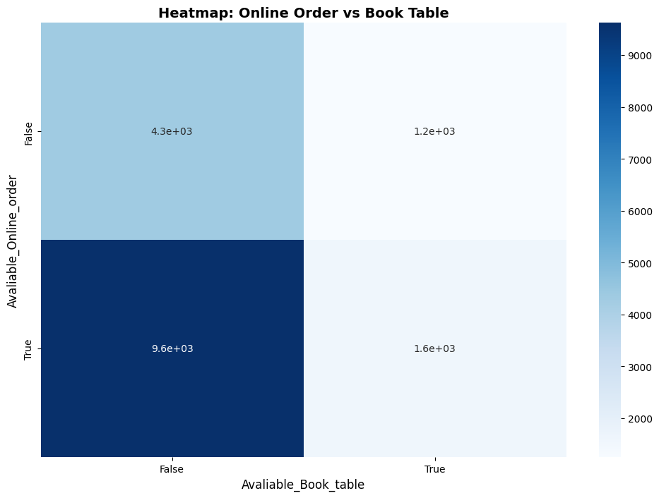
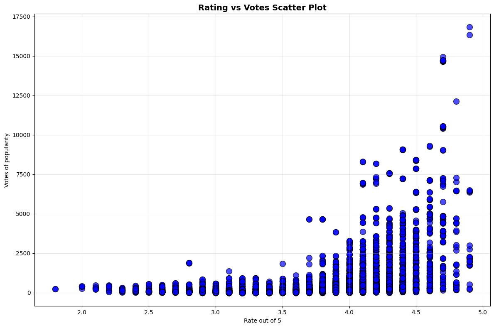
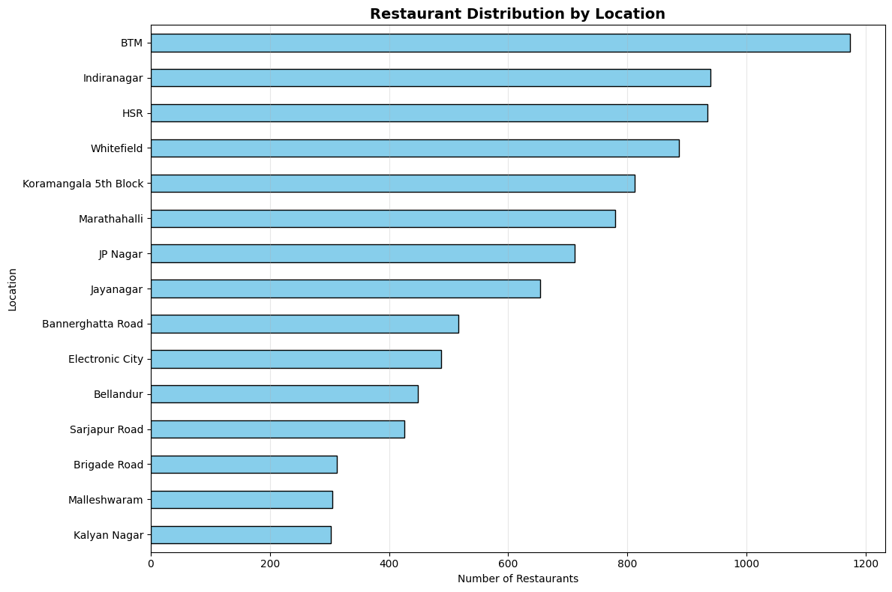
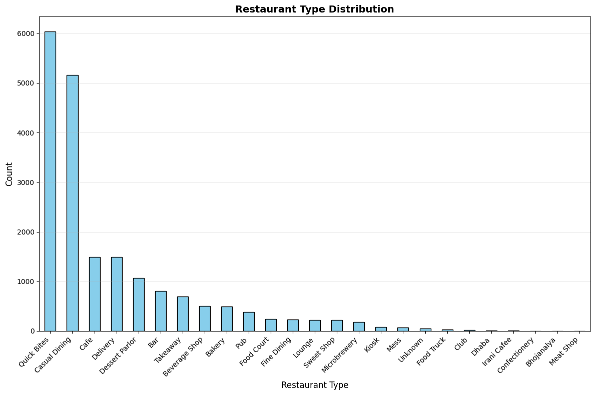
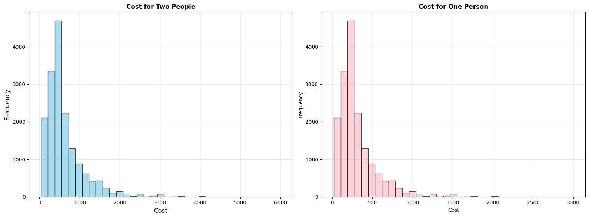

# 🍽️ Zomato Data Cleaning, EDA, and ELT Project

## 📖 Overview
This project demonstrates a complete **data cleaning**, **exploratory data analysis (EDA)**, and **ELT (Extract, Load, Transform)** workflow on the **Zomato Restaurants Dataset** sourced from Kaggle.  
The goal is to clean and transform messy raw data, uncover key business insights through visualization, and finally load and query the cleaned data using **SQLite**.

---

## 🔗 Dataset
**Source:** [Zomato Dataset – Kaggle](https://www.kaggle.com/datasets/rishikeshkonapure/zomato/data)  
This dataset contains information about restaurants listed on Zomato, including their name, location, cuisines, ratings, votes, cost, and online order availability.

---

## ⚙️ Tech Stack & Tools
- **Language:** Python  
- **Environment:** Jupyter Notebook (`notebook.ipynb`)
- **Libraries Used:**
  - 🐼 `pandas` → Data cleaning, preprocessing, and analysis  
  - 📊 `seaborn` → Visualizing correlations and categorical insights  
  - 📈 `matplotlib.pyplot` → Plotting charts and trends  
  - 🗃️ `sqlite3` → Storing and querying cleaned data for ELT  

---

## 🧠 Project Workflow

### 1. 🧹 Data Cleaning
- Removed null values and duplicate records  
- Standardized inconsistent column names  
- Cleaned city, rating, and cost columns  
- Converted data types for numerical consistency  
- Removed unwanted symbols and spaces  

### 2. 📊 Exploratory Data Analysis (EDA)
- **Restaurant distribution by city** (bar chart)  
- **Online order vs Table booking availability** (side-by-side bar plots)  
- **Most popular cuisines** (count plot)  
- **Average ratings and votes distribution** (histogram & boxplot)  
- **Correlation heatmap** to understand relationships among variables  

### 3. 🔄 ELT Process
- **Extract:** Imported raw Zomato dataset from Kaggle (CSV format)  
- **Load:** Loaded cleaned dataset into a **SQLite database**  
- **Transform:**  
  - Executed SQL queries for data aggregation and filtering  
  - Example queries:  
    - Top-rated restaurants by city  
    - Most popular cuisines  
    - Average cost for two per city  

```

## 📁 Project Structure
Data_cleaning-AND-ELT/
  -├── notebook.ipynb # Main Jupyter Notebook with cleaning, EDA, and ELT process.
  -├── data/ # Raw and cleaned datasets (optional).
  -├── output/ # Processed data and SQLite database.
  -├── requirements.txt # Python dependencies.
  -└── README.md # Project documentation.


```

## 📈 Sample Visuals
- **City-wise Restaurant Count**
- **Online vs Dine-in Availability**
- **Average Rating Distribution**
- **Cuisine Popularity Analysis**
- **Correlation Heatmap**

*(All visuals are generated using Matplotlib and Seaborn for better insights.)*

### Sample Visuals

#### Restaurants by City
Bar chart showing the number of restaurant ratings given by customers.  


#### Online vs Table Booking
Comparison of online order vs table booking availability.  


#### Online vs Table Booking Heatmap
Heatmap showing Online Order vs Table Booking distribution.  


#### Rating vs Popularity
Scatter plot showing restaurant ratings vs vote count (popularity).  


#### Restaurants Distribution by Location
Horizontal bar graph representing top 15 locations by number of restaurants.  


#### Restaurant Types Distribution
Bar graph showing top 15 restaurant types by count.  


#### Cost Analysis
Side-by-side bar chart comparing cost for two people vs one person.  



---

## 🚀 How to Run This Project
1. Clone the repository:
   ```bash
   git clone https://github.com/akashcstech/Data_cleaning-AND-ELT.git
   cd Data_cleaning-AND-ELT
2. Install the dependencies:
    ```bash
    pip install -r requirements.txt


3. Launch Jupyter Notebook:

   ```bash
    jupyter notebook notebook.ipynb

4 .Run the notebook cells step-by-step to follow the full cleaning, EDA, and ELT process.

@Author

Akash S
🔗 GitHub: https://github.com/akashcstech
🔗 Email: akash.cstech@gmail.com

💼 Aspiring Data Engineer passionate about Python, SQL, and data pipeline automation.

